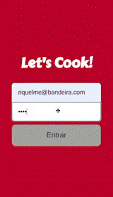

# Projeto App de Receitas

# Contexto

Este projeto é uma aplicação focada em dispositivos móveis, onde pode-se explorar receitas de comidas e bebidas, favoritá-las e acompanhar sua preparação.

A interface é alimentada por duas API's, TheMealDB e TheCockTailDB, que fornecem receitas de comidas e bebidas.



## Tecnologias usadas

* React
* Redux
* Context API
* React Hooks

## Instalando o projeto

1. Clone o repositório:

```
git clone git@github.com:riquelmebandeira/projeto-recipes-app.git
```

2. Entre na pasta do repositório clonado:

```
cd projeto-recipes-app
```

3. Instale as dependências com o comando:

```
npm install
```

## Executando a aplicação

  ```
  npm start
  ```
